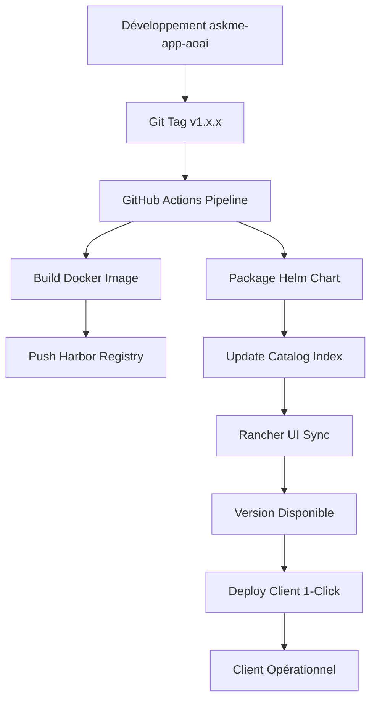

# 🚀 AskMe Rancher Catalog

Catalog Rancher officiel pour les déploiements AskMe multi-clients avec support de plusieurs providers LLM.

## 🎯 Fonctionnalités

- **🎛️ Déploiement en 1 clic** depuis l'interface Rancher
- **🏷️ Versioning Git** : Sélection de version (latest, v1.0.0, v1.1.0, etc.)
- **⚙️ Configuration par client** : Variables d'environnement personnalisables via interface web
- **🏢 Multi-tenant** : Isolation complète par namespace et client
- **✅ Production Ready** : Templates testés et validés en production
- **🤖 Multi-LLM Support** : Azure OpenAI, Claude, OpenAI Direct, Mistral, Gemini

## 🚀 Guide de Démarrage Rapide

### 1. Configurer le Catalog dans Rancher

#### Via Interface Web
1. Se connecter à Rancher : `https://jg8s67.9r1m.rancher.ovh.net`
2. **Apps & Marketplace** → **Repositories** → **Create**
3. Configuration :
   ```
   Name: askme-catalog
   Target: Git repository containing Helm chart
   Git Repo URL: https://github.com/avanteam/askme-rancher-catalog
   Git Branch: main
   ```

#### Via kubectl
```bash
kubectl apply -f rancher-catalog-setup.yaml
```

### 2. Déployer un Client
1. **Apps & Marketplace** → **Charts**
2. Rechercher **"AskMe"**
3. **Install** → Sélectionner **version** → Configurer **variables**
4. **Deploy** ✨

## 📋 Configuration Client

### Configuration Essentielle
- **Nom du Client** : `askme-principal`
- **Domaine** : `askme.avanteam-online.com`
- **Namespace** : `askme-app`

### Configuration LLM
- **Provider par défaut** : `CLAUDE`
- **Providers disponibles** : `AZURE_OPENAI,CLAUDE,OPENAI_DIRECT,MISTRAL,GEMINI`

### API Keys (sécurisées)
- **Azure OpenAI** : `Ckt6vNVrM1RMG0z0Zpz...`
- **Claude AI** : `sk-ant-api03-GUzW2wcze...`
- **Azure Search** : `cmAQfwk1UFi0CrA1nu6H...`
- **Azure CosmosDB** : `X1sw13XIqynJYeB2AY6h...`
- **Azure Speech** : `DbsYXoSVuWrPh4cB5fI6...`

### Fonctionnalités Avancées
- **Reconnaissance vocale** : Mots-clés personnalisables
- **Upload d'images** : Support multimodal
- **Historique** : Persistance CosmosDB ou MongoDB
- **Multi-tenant MongoDB** : Base de données isolée par client

## 🔄 Workflow de Release Intégré

### Développement → Production
```bash
# 1. Développement dans askme-app-aoai
git checkout develop
# ... développement ...
git commit -m "feat: nouvelle fonctionnalité"

# 2. Release synchronisée
git tag v1.2.0
git push origin v1.2.0

# 3. Pipeline automatique :
# ✅ Build Docker image avec tag v1.2.0
# ✅ Package Helm chart v1.2.0
# ✅ Mise à jour catalog Rancher
# ✅ Version v1.2.0 disponible dans UI
```

### Déploiement Client
- **Interface Rancher** : Sélection de version dans dropdown
- **Configuration guidée** : Formulaire web avec tous les paramètres
- **Rolling update** : Mise à jour sans interruption
- **Rollback 1-clic** : Retour version précédente

## 🏗️ Architecture

### Structure Repository
```
askme-rancher-catalog/
├── charts/askme/               # Chart Helm principal
│   ├── Chart.yaml              # Métadonnées et version
│   ├── values.yaml             # Configuration par défaut (386 lignes)
│   ├── questions.yaml          # Interface Rancher (formulaire)
│   ├── scripts/                # Scripts DNS OVH
│   └── templates/              # Manifestes Kubernetes (9 fichiers)
│       ├── configmap.yaml      # Configuration application
│       ├── deployment.yaml     # Déploiement principal
│       ├── service.yaml        # Service Kubernetes
│       ├── ingress.yaml        # Exposition HTTPS + Let's Encrypt
│       ├── dns-job.yaml        # Création DNS automatique OVH
│       ├── mongodb-init-job.yaml    # Job d'initialisation MongoDB
│       ├── mongodb-service.yaml     # Service MongoDB cross-namespace
│       ├── global-secret-sync.yaml  # Synchronisation secrets globaux
│       ├── global-secret-rbac.yaml  # RBAC pour accès secrets
│       ├── rancher-project.yaml     # Projet Rancher isolation
│       └── rancher-rbac.yaml        # Permissions Rancher RBAC
├── docs/                       # Documentation spécialisée
│   └── rancher-setup.md        # Guide configuration Rancher
│   └── MONGODB_MULTITENANT_GUIDE.md # Guide complet MongoDB
├── .github/workflows/          # Pipeline CI/CD
├── index.yaml                  # Index catalog Helm (auto-généré)
├── README-MONGODB.md           # Documentation MongoDB
├── test-catalog.sh            # Tests automatisés
├── deploy-client.sh           # Script déploiement client
├── migrate-client-to-mongodb.sh # Migration CosmosDB → MongoDB
├── init-mongodb-client.sh     # Initialisation client MongoDB
└── update-mongodb-secrets.sh  # Mise à jour secrets MongoDB
```

### Intégrations
- **Harbor Registry OVH** : Images Docker privées (7wpjr0wh.c1.gra9.container-registry.ovh.net)
- **DNS OVH** : Création automatique sous-domaines avec validation sécurité
- **Let's Encrypt** : Certificats SSL automatiques
- **Rancher RBAC** : Permissions granulaires par projet avec isolation namespace
- **MongoDB Multi-tenant** : Cluster partagé avec bases de données isolées par client
- **Azure Services** : OpenAI, Cognitive Search, CosmosDB, Speech Services
- **Global Secrets** : Synchronisation automatique des API keys depuis askme-platform

## 🍃 Architecture MongoDB Multi-Tenant

### Providers d'Historique Supportés
- **COSMOSDB** : Azure CosmosDB (historique, stable)
- **MONGODB** : MongoDB Replica Set (nouveau, recommandé pour nouveaux clients)

### Architecture MongoDB
```
MongoDB Cluster (askme-mongodb namespace)
├── Replica Set (rs0) : 3 nœuds pour haute disponibilité
├── askme_avanteam/          # Database client principal
│   ├── conversations        # Collection conversations
│   └── messages            # Collection messages + index optimisés
├── askme_qsaas/            # Database QSaaS
│   ├── conversations
│   └── messages
└── askme_demo/             # Database demo
    ├── conversations
    └── messages
```

### Sécurité et Isolation
- **Isolation complète** : Chaque client dispose de sa propre database MongoDB
- **Credentials uniques** : Utilisateur et mot de passe générés automatiquement (32 caractères)
- **Permissions minimales** : readWrite uniquement sur la database du client
- **Secrets Kubernetes** : Credentials stockés sécurisément dans les secrets du namespace client
- **Cross-namespace services** : Service mongodb-external dans chaque namespace client

### Déploiement MongoDB via Rancher UI
1. **History Configuration** → `Provider Historique` → Sélectionner **MONGODB**
2. **MongoDB Configuration** → `Activer MongoDB` → ✅ Cocher
3. **Initialisation automatique** → ✅ Cocher (recommandé)
4. **Deploy** → Job d'initialisation automatique crée :
   - Database `askme_<client_name>`
   - Utilisateur `askme_<client_name>_user`
   - Collections avec index optimisés
   - Secret Kubernetes avec credentials

### Scripts de Gestion MongoDB
- `init-mongodb-client.sh` : Initialisation manuelle d'un client MongoDB
- `migrate-client-to-mongodb.sh` : Migration CosmosDB → MongoDB
- `update-mongodb-secrets.sh` : Mise à jour des secrets MongoDB globaux

### Coexistence CosmosDB/MongoDB
- **Clients existants** : Peuvent rester sur CosmosDB
- **Nouveaux clients** : Recommandé d'utiliser MongoDB
- **Migration progressive** : Possible avec scripts de migration

## 🏷️ Versions et Compatibilité

| Version | Date | Features | Status |
|---------|------|----------|--------|
| **v1.0.25** | 2025-09-23 | MongoDB multi-tenant + corrections | ✅ Stable |
| **v1.0.24** | 2025-09-23 | MongoDB Shell optimisé (mongo:7-jammy) | ✅ Stable |
| **v1.0.21** | 2025-09-17 | Support complet MongoDB multi-client | ✅ Stable |
| **v1.0.10** | 2025-09-12 | Configuration Avanteam Custom complète | ✅ Stable |
| **v1.0.0** | 2025-07-30 | Multi-LLM support initial | ✅ Stable |
| **latest** | Continue | Dernière version stable (v1.0.25) | ✅ Recommandé |

## 🔧 Gestion et Maintenance

### Mise à Jour Client
1. **Installed Apps** → Sélectionner client → **Upgrade**
2. Choisir nouvelle version → Ajuster configuration → **Upgrade**

### Monitoring
- **Rancher Dashboard** : Métriques temps réel
- **Logs centralisés** : Via interface Rancher
- **Alerting** : Intégration Prometheus/Grafana

### Rollback
- **1-clic rollback** depuis interface Rancher
- **Préservation configuration** : Les settings restent intacts
- **Zero downtime** : Bascule sans interruption service

## 🛡️ Sécurité

- **API Keys** : Stockage Kubernetes Secrets (encodage base64)
- **RBAC** : Isolation par namespace et projet Rancher
- **Network Policies** : Contrôle trafic réseau
- **Image Scanning** : Vérification sécurité Harbor

## 📊 Tests et Validation

```bash
# Tests automatisés complets
./test-catalog.sh validate

# Tests de déploiement avec MongoDB
./test-catalog.sh deploy test-client
./deploy-client.sh test-mongodb --mongodb

# Tests de migration CosmosDB → MongoDB
./migrate-client-to-mongodb.sh test-client --dry-run
```

## 🆘 Support et Documentation

- **Setup Rancher** : [`docs/rancher-setup.md`](docs/rancher-setup.md)
- **Guide MongoDB** : [`MONGODB_MULTITENANT_GUIDE.md`](MONGODB_MULTITENANT_GUIDE.md) - Documentation complète multi-tenant
- **Documentation MongoDB** : [`README-MONGODB.md`](README-MONGODB.md) - Guide technique
- **Tests de validation** : `test-catalog.sh` - Tests automatisés complets
- **Repository source** : [askme-app-aoai](https://github.com/avanteam/askme-app-aoai) - Code application
- **Issues** : GitHub Issues pour rapports bugs/demandes fonctionnalités

---

## 🎯 Workflow Complet



**🚀 Déploiement AskMe simplifié : du code source au client final en quelques clics !**