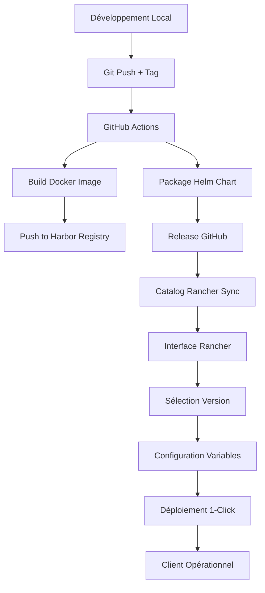

# Configuration Rancher pour AskMe Catalog

Guide pour configurer Rancher afin d'utiliser le catalog AskMe et déployer des clients via l'interface web.

## 🎯 Objectif

Avoir un **"App Store AskMe"** dans Rancher permettant de :
- Sélectionner la version souhaitée (latest, v1.0.0, v1.1.0, etc.)
- Configurer les variables client via formulaire web
- Déployer en 1 clic
- Mettre à jour les clients existants
- Faire des rollbacks si nécessaire

## 📋 Prérequis

- Rancher Server accessible : `https://jg8s67.9r1m.rancher.ovh.net`
- Cluster Kubernetes configuré : `c-m-g8b9wrhd`
- Droits administrateur sur Rancher
- Repository Git pour le catalog : `https://github.com/avanteam/askme-rancher-catalog`

## 🚀 Configuration Étape par Étape

### 1. Ajouter le Catalog Git dans Rancher

#### Via l'Interface Web
1. **Se connecter à Rancher** : `https://jg8s67.9r1m.rancher.ovh.net`
2. **Aller dans Apps & Marketplace** → **Repositories**
3. **Cliquer sur "Create"**
4. **Configurer le repository** :
   ```
   Name: askme-catalog
   Target: Git repository containing Helm chart or cluster template definitions
   Git Repo URL: https://github.com/avanteam/askme-rancher-catalog
   Git Branch: main
   ```
5. **Cliquer sur "Create"**

#### Via kubectl (Alternative)
```bash
kubectl apply -f - <<EOF
apiVersion: catalog.cattle.io/v1
kind: ClusterRepo
metadata:
  name: askme-catalog
spec:
  gitRepo: https://github.com/avanteam/askme-rancher-catalog
  gitBranch: main
EOF
```

### 2. Vérifier que le Catalog est Synchronisé

1. **Apps & Marketplace** → **Repositories**
2. Vérifier que **askme-catalog** a le status **Active**
3. **Apps & Marketplace** → **Charts**
4. Chercher **"AskMe"** dans la liste

### 3. Créer un Projet Rancher (Optionnel)

Pour organiser les déploiements AskMe :

1. **Cluster** → **Projects/Namespaces**
2. **Create Project**
3. **Nom** : `AskMe Clients`
4. **Description** : `Projets pour les déploiements AskMe multi-clients`

## 🎛️ Déploiement d'un Client

### Via l'Interface Rancher

1. **Apps & Marketplace** → **Charts**
2. **Chercher "AskMe"** ou naviguer dans le catalog `askme-catalog`
3. **Cliquer sur "AskMe"**
4. **Sélectionner la version** :
   - `latest` : Dernière version de développement
   - `v1.0.0` : Version stable 1.0.0
   - `v1.1.0` : Version stable 1.1.0
5. **Cliquer sur "Install"**

### Configuration du Formulaire

Le formulaire Rancher affichera automatiquement tous les champs définis dans `questions.yaml` :

#### **Configuration Client**
- **Nom du Client** : `askme-principal`
- **Domaine Client** : `askme.avanteam-online.com`
- **Namespace** : `askme-app`

#### **Interface Utilisateur**
- **Titre de l'Application** : `Avanteam AskMe`
- **Description** : `Assistant IA ...`
- **Logo Principal** : URL du logo

#### **Configuration LLM**
- **Fournisseur LLM Par Défaut** : `CLAUDE`
- **Fournisseurs Disponibles** : `AZURE_OPENAI,CLAUDE,OPENAI_DIRECT,MISTRAL,GEMINI`

#### **Azure OpenAI**
- **Activer Azure OpenAI** : ✅
- **Endpoint** : `https://askmeopenai.openai.azure.com/`
- **API Key** : `Ckt6vNVrM1RMG0z0Zpz...` (champ sécurisé)
- **Modèle** : `gpt-4o`

#### **Claude AI**
- **Activer Claude** : ✅
- **API Key** : `sk-ant-api03-GUzW2wcze...` (champ sécurisé)
- **Modèle Claude** : `claude-sonnet-4-20250514`

#### **Azure Search**
- **Service Search** : `askmesearchprod`
- **Index** : `idx-v-avanteam-qualitysaas-dev`
- **API Key** : `cmAQfwk1UFi0CrA1nu6H...` (champ sécurisé)

#### **Azure CosmosDB**
- **Compte CosmosDB** : `db-askme-avanteam-qualitysaas-dev-historique`
- **Base de Données** : `db_conversation_history`
- **Clé Primaire** : `X1sw13XIqynJYeB2AY6h...` (champ sécurisé)

#### **Services Vocaux**
- **Activer Azure Speech** : ✅
- **Mots-clés Vocaux** : ✅
- **Mots-clés** : `Sarah,Richard,Patrick,Mérade`

#### **Ressources**
- **CPU Demandé** : `250m`
- **Mémoire Demandée** : `512Mi`
- **Nombre de Pods** : `2`

6. **Cliquer sur "Install"**

### Résultat

Rancher va automatiquement :
- Créer le namespace `askme-app`
- Déployer les ressources Kubernetes (ConfigMap, Secret, Deployment, Service, Ingress)
- Configurer les sondes de santé
- Appliquer les quotas de ressources

## 🔄 Mise à Jour d'un Client

### Via l'Interface Rancher

1. **Apps & Marketplace** → **Installed Apps**
2. **Sélectionner le client** (ex: `askme-principal`)
3. **Cliquer sur l'icône "⋮"** → **Upgrade**
4. **Choisir la nouvelle version** (ex: `v1.1.0`)
5. **Modifier les variables** si nécessaire
6. **Cliquer sur "Upgrade"**

### Types de Mises à Jour

#### **Mise à Jour de Version**
- Nouvelle image Docker
- Nouvelles fonctionnalités
- Corrections de bugs

#### **Mise à Jour de Configuration**
- Modifier les API keys
- Changer les paramètres LLM
- Ajuster les ressources

#### **Rollback**
- **Installed Apps** → **Client** → **⋮** → **Rollback**
- Sélectionner la version précédente
- Confirm

## 📊 Monitoring et Logs

### Via Rancher

1. **Workloads** → **Deployments**
2. **Sélectionner le déploiement AskMe**
3. **Onglets disponibles** :
   - **Pods** : État des conteneurs
   - **Logs** : Logs applicatifs
   - **Events** : Événements Kubernetes
   - **Metrics** : CPU, RAM, réseau

### Via kubectl

```bash
# Status global
kubectl get all -n askme-app

# Logs applicatifs
kubectl logs deployment/askme-app -n askme-app --tail=50

# Événements
kubectl get events -n askme-app --sort-by='.lastTimestamp'
```

## 🛠️ Dépannage

### Chart non visible dans Rancher

1. **Vérifier le repository** :
   ```bash
   kubectl get clusterrepos askme-catalog -o yaml
   ```

2. **Forcer la synchronisation** :
   ```bash
   kubectl annotate clusterrepo askme-catalog catalog.cattle.io/last-refresh-
   ```

### Erreur de déploiement

1. **Vérifier les logs Rancher** :
   - **Apps & Marketplace** → **Installed Apps** → **Client** → **Logs**

2. **Vérifier les événements Kubernetes** :
   ```bash
   kubectl get events -n askme-app --sort-by='.lastTimestamp'
   ```

### Variables manquantes

1. **Vérifier questions.yaml** dans le repository Git
2. **Re-synchroniser le catalog**
3. **Réessayer l'installation**

## 🔐 Sécurité

### Secrets Kubernetes

Les API keys sont automatiquement stockées dans des **Kubernetes Secrets** :
- Encodage base64 automatique
- Accès limité au namespace
- Rotation possible via mise à jour

### RBAC Rancher

Le chart inclut la configuration RBAC pour :
- Isolation par projet Rancher
- Contrôle d'accès granulaire
- Intégration avec les utilisateurs Rancher

## 📈 Bonnes Pratiques

### Versioning

- **Utiliser des versions sémantiques** : `v1.0.0`, `v1.1.0`, `v2.0.0`
- **Tester en staging** avant production
- **Documenter les breaking changes**

### Configuration

- **Séparer les environnements** : dev, staging, prod
- **Utiliser des secrets externes** si nécessaire (Vault, etc.)
- **Monitorer les quotas** de ressources

### Déploiements

- **Déployer progressivement** : un client à la fois
- **Vérifier la santé** après chaque déploiement
- **Maintenir des sauvegardes** des configurations

## 🚀 Workflow Complet



Avec cette configuration, tu auras un véritable **App Store AskMe** dans Rancher ! 🎉